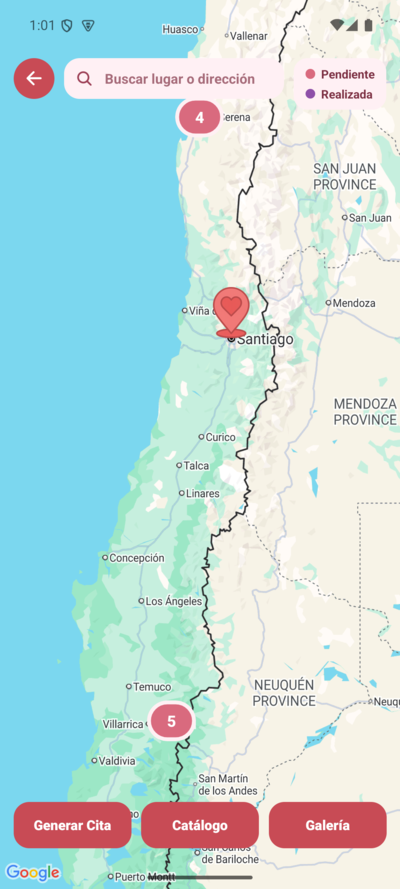
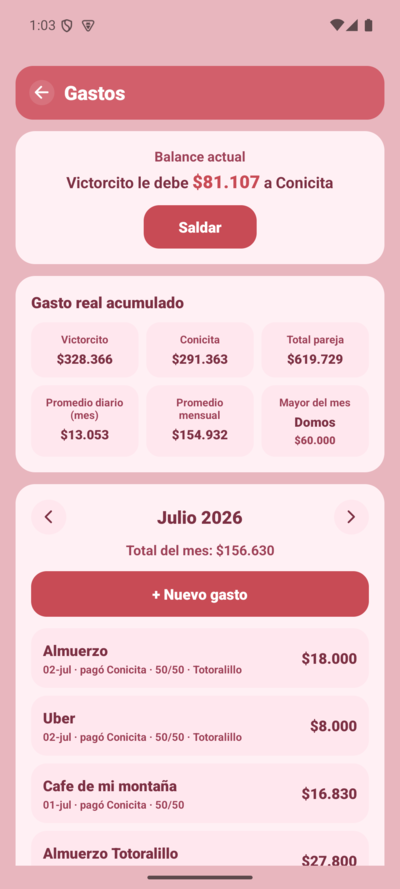
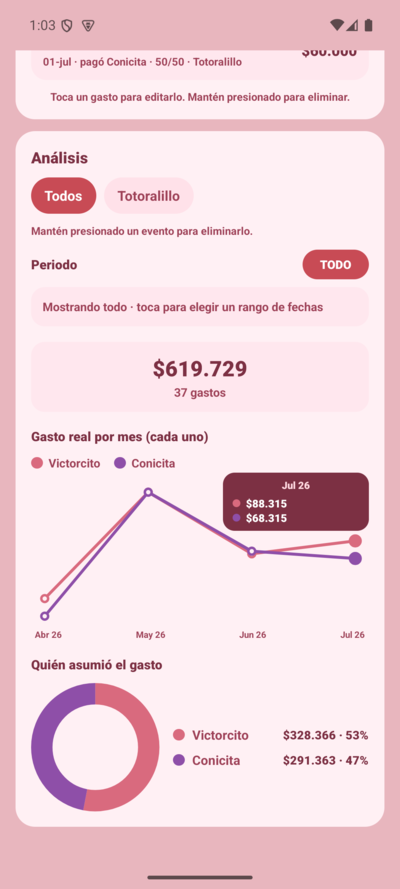
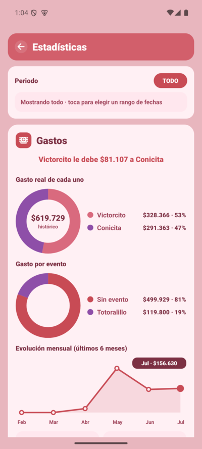
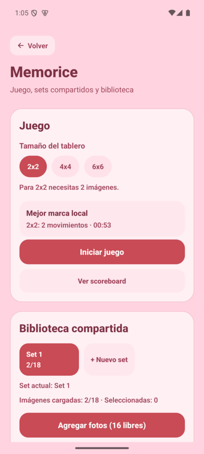

# appmorcito

App de pareja: planificá y registrá **citas** (lugares y visitas con fotos), llevá las **cuentas
compartidas** (gastos y eventos), una **wishlist** colaborativa y **estadísticas** de la relación.

📦 **[Descargar APK (Releases)](https://github.com/Snickmax/appmorcito/releases/latest)**

## Screenshots

| Inicio | Citas (mapa con clustering) | Gastos |
|:---:|:---:|:---:|
|  |  |  |

| Análisis de gastos | Estadísticas | Memorice |
|:---:|:---:|:---:|
|  |  |  |

## Stack

- **Expo** SDK 54 / **React Native** 0.81 + **TypeScript**
- **Supabase** (Postgres + Auth + Storage) como backend
- **React Navigation** (native-stack)
- Gestor de paquetes: **pnpm** (este equipo no tiene `npx`)

## Requisitos

- Node.js + `pnpm`
- **Android SDK** en `~/Android/Sdk` y un emulador (AVD `morcito`) o un dispositivo físico
- **JDK 17** — solo necesario para generar builds de release (ver [`BUILD.md`](BUILD.md))

## Setup desde cero

```bash
git clone <repo> && cd appmorcito
pnpm install
```

1. **Variables de entorno** — crear `.env` en la raíz:

   ```env
   EXPO_PUBLIC_SUPABASE_URL=https://<tu-proyecto>.supabase.co
   EXPO_PUBLIC_SUPABASE_ANON_KEY=<anon-key>
   ```

   > `.env` está en `.gitignore`: no se versiona. Pedí los valores a quien administre el proyecto.

2. **Base de datos** — aplicar las migraciones de Supabase. Ver [`supabase/README.md`](supabase/README.md).

3. **Correr en desarrollo**:

   ```bash
   ./dev-android.sh
   ```

   Arranca el emulador `morcito` (si no está corriendo) y lanza Expo en Android.

## Scripts

| Comando | Qué hace |
|---|---|
| `pnpm start` | Expo dev server (elegís plataforma) |
| `pnpm android` / `pnpm ios` / `pnpm web` | Expo en la plataforma indicada |
| `./dev-android.sh` | Emulador Android + Expo, en un solo paso |
| `./build-release.sh` | Genera APK + AAB de release (ver [`BUILD.md`](BUILD.md)) |

## Estructura

```
src/
├── components/   # componentes reutilizables
├── screens/      # pantallas (citas, gastos, wishlist, stats, ...)
├── navigation/   # configuración de navegación
├── providers/    # contextos globales (auth, pareja, ...)
├── hooks/        # hooks compartidos
├── lib/          # cliente Supabase y demás integraciones
├── theme/        # estilos y tema
├── constants/    # constantes
├── types/        # tipos TypeScript
└── utils/        # utilidades
```

## Documentación relacionada

- [`BUILD.md`](BUILD.md) — generar APK/AAB de producción y qué respaldar.
- [`supabase/README.md`](supabase/README.md) — esquema, migraciones y rollbacks.
